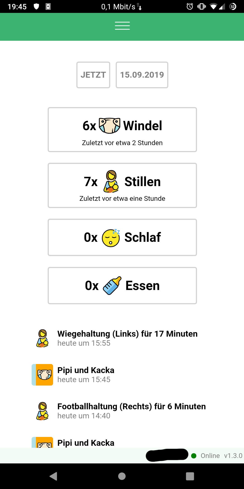
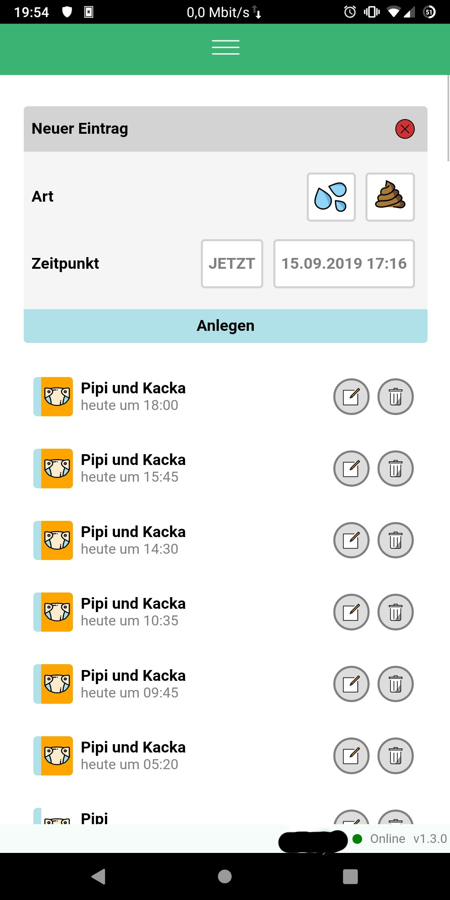
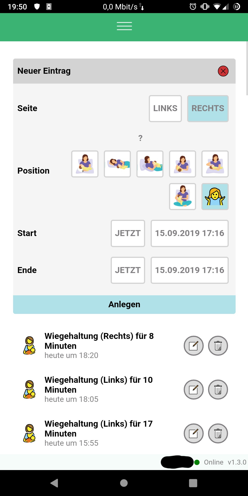
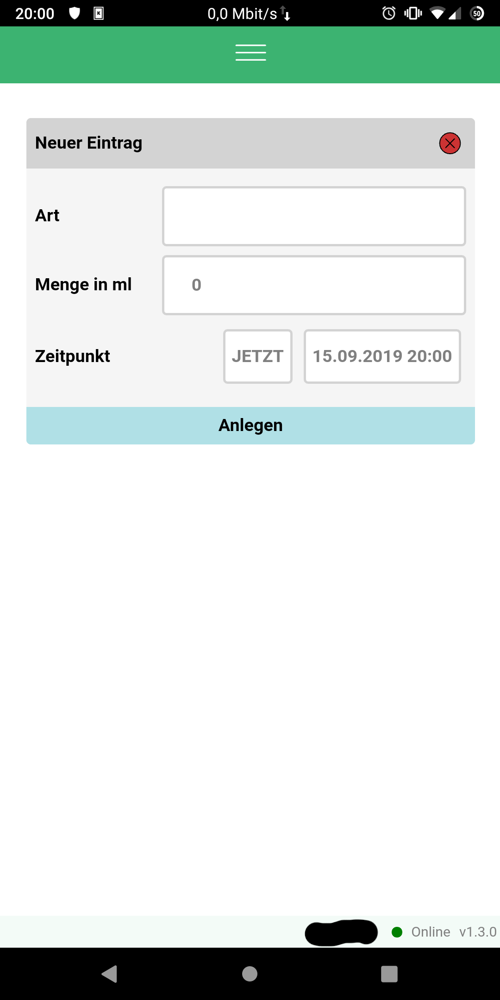
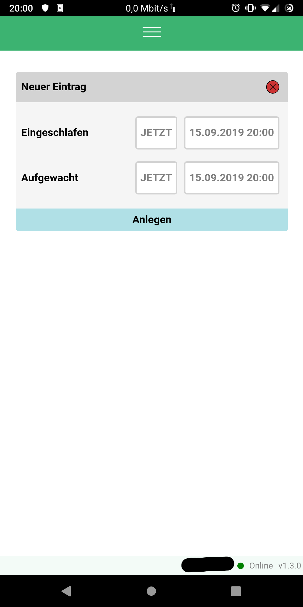

# Baby Tracker

**A progressive web app to track your baby and share the data with your family in real-time.**

# Features

Create a new baby by entering his/her name in the designated field. Afterwards
you will receive a unique id which represents your baby. Share this id with
your husband, family and friends. All inserts, updates and deletes will be
synced to everyone in realtime, thanks to the magic of websockets.

At the moment four activities can be tracked.

## Daily Overview

## Diaper

Only pee? Or with poop? Which color did the poop have?

## Nursing

Left or right? Which position did I use?

## Food

What did we give the baby and how much?

## Sleep

You will have many little entries - trust me ;)

# Develop

`docker-compose up`

## License

Licensed under the MIT License, Copyright © 2019-present Mike Barkmin.

See [LICENSE](./LICENSE) for more information.
